# Báo cáo bug – BK Voice

| | |
|---|---|
| **Ứng dụng** | BK Voice (Bê Ka Voice) – https://ai.bkholding.vn/aimeet_app/ |
| **Ngày test** | 05/10/2026 |
| **Cách test** | Kiểm thử tự động bằng Playwright, tester xem lại và xác nhận từng lỗi |
| **Số bug** | 28 bug, tất cả đang mở |
| **Mức độ** | 1 Cao · 24 Trung bình · 3 Thấp |

## Tóm tắt

28 bug được gộp thành 11 nhóm theo nguyên nhân chung. Sửa theo nhóm sẽ xử lý được nhiều bug cùng lúc.

| # | Nhóm lỗi | Số bug | Bug |
|---|---|---|---|
| 1 | [Bấm nhiều lần tạo ra bản ghi trùng](#nhom-1) | 2 | B01, B02 |
| 2 | [Máy chủ trả lỗi, chức năng không dùng được](#nhom-2) | 2 | B03, B04 |
| 3 | [Chức năng dịch trả lại nguyên văn](#nhom-3) | 3 | B05–B07 |
| 4 | [API không trả thời lượng bản ghi](#nhom-4) | 2 | B08, B09 |
| 5 | [Dữ liệu liên kết bị ghi đè hoặc mất](#nhom-5) | 3 | B10–B12 |
| 6 | [Form không kiểm tra dữ liệu nhập](#nhom-6) | 5 | B13–B17 |
| 7 | [Bộ lọc không kiểm tra khoảng giá trị](#nhom-7) | 3 | B18–B20 |
| 8 | [Tìm kiếm không chuẩn hóa từ khóa](#nhom-8) | 2 | B21, B22 |
| 9 | [Giao diện không tự cập nhật sau thay đổi](#nhom-9) | 2 | B23, B24 |
| 10 | [Hiển thị chưa Việt hóa, thông báo lỗi kỹ thuật](#nhom-10) | 2 | B25, B26 |
| 11 | [Lỗi riêng lẻ](#nhom-11) | 2 | B27, B28 |

### Danh sách đầy đủ

| Bug | Test case | Chức năng | Mức độ |
|---|---|---|---|
| B01 | TC02 – Chống tạo trùng khi bấm Tạo cuộc họp hai lần | Cuộc họp | **Cao** |
| B02 | TC15 – Bấm Phân tích mới khi đang chạy không tạo bản trùng | Phân tích AI | Trung bình |
| B03 | TC19 – Đăng ký người nói với nhà cung cấp cochl | Người nói | Trung bình |
| B04 | TC06 – Xóa prompt trong Thư viện Prompt | Phân tích AI | Trung bình |
| B05 | TC02 – Dịch Anh → Việt | Dịch văn bản | Trung bình |
| B06 | TC03 – Dịch nguồn Tự động → Việt | Dịch văn bản | Trung bình |
| B07 | TC04 – Dịch Việt → Anh | Dịch văn bản | Trung bình |
| B08 | TC15 – Thời lượng đã tải trên trang chủ | Trang chủ | Trung bình |
| B09 | TC07 – Bộ lọc thời lượng 60–70 phút | Tìm kiếm & lọc | Trung bình |
| B10 | TC16 – Đăng ký trùng tên người nói | Người nói | Trung bình |
| B11 | TC04 – Cảnh báo khi chọn bản ghi đang thuộc cuộc họp khác | Cuộc họp | Trung bình |
| B12 | TC13 – Xóa bản ghi cập nhật số liệu cuộc họp | Chia sẻ & xóa bản ghi | Trung bình |
| B13 | TC03 – Bắt buộc nhập trường của mẫu cuộc họp | Cuộc họp | Thấp |
| B14 | TC07 – Hai trường trùng Khóa trong mẫu cuộc họp | Mẫu cuộc họp | Trung bình |
| B15 | TC05 – Hạn hoàn thành không phải ngày ('abc') | Nhiệm vụ | Thấp |
| B16 | TC06 – Thêm dòng nhiệm vụ bỏ trống mô tả | Nhiệm vụ | Thấp |
| B17 | TC06 – Tốc độ bit ngoài khoảng 16–320 | Tải file ghi âm | Trung bình |
| B18 | TC10 – Từ ngày lớn hơn Đến ngày | Tìm kiếm & lọc | Trung bình |
| B19 | TC22 – Thời lượng Tối thiểu là số âm | Tìm kiếm & lọc | Trung bình |
| B20 | TC23 – Thời lượng Tối thiểu lớn hơn Tối đa | Tìm kiếm & lọc | Trung bình |
| B21 | TC20 – Tìm từ khóa có khoảng trắng đầu/cuối | Tìm kiếm & lọc | Trung bình |
| B22 | TC13 – Tìm tên có dấu 'Họp 16-09.mp3' | Tìm kiếm & lọc | Trung bình |
| B23 | TC09 – Đổi tên xong danh sách bên trái cập nhật ngay | Chi tiết bản ghi | Trung bình |
| B24 | TC08 – Xử lý xong thì danh sách tự chuyển sang Hoàn thành | Tải file ghi âm | Trung bình |
| B25 | TC09 – Nhãn loại trong hộp Công cụ AI | Phân tích AI | Trung bình |
| B26 | TC08 – Đăng ký với tên đăng nhập đã tồn tại | Đăng ký & đăng nhập | Trung bình |
| B27 | TC03 – Mẫu có thông tin mặc định thì form điền sẵn | Mẫu cuộc họp | Trung bình |
| B28 | TC07 – Thời gian tạo audio theo giờ Việt Nam | Chuyển văn bản thành giọng nói | Trung bình |

---

## Nhóm 1 – Bấm nhiều lần tạo ra bản ghi trùng

**Nguyên nhân chung:** nút gửi không bị khóa trong lúc yêu cầu đang xử lý, nên mỗi lần bấm đều gửi thêm một yêu cầu mới.
**Hướng sửa chung:** khóa nút (disabled + trạng thái đang tải) từ lúc bấm đến khi có phản hồi; phía máy chủ nên chặn yêu cầu trùng.

### B01 – Bấm "Tạo cuộc họp" hai lần tạo ra hai cuộc họp
- **Mức độ:** Cao · **Chức năng:** Cuộc họp · **Test case:** TC02
- **Mong đợi:** Bấm "Tạo cuộc họp" hai lần liên tiếp chỉ tạo 1 cuộc họp.
- **Thực tế:** Tạo ra 2 cuộc họp cùng tên, cách nhau 1 giây (5:15:00 và 5:15:01). Bấm bao nhiêu lần thì tạo bấy nhiêu cuộc họp.

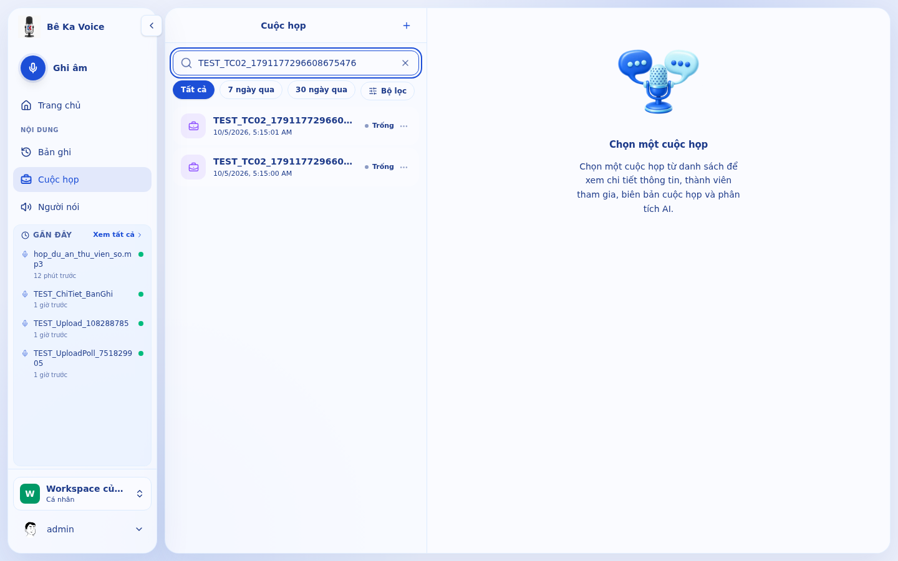

### B02 – Bấm "Phân tích mới" khi đang chạy tạo ra hai kết quả trùng
- **Mức độ:** Trung bình · **Chức năng:** Phân tích AI · **Test case:** TC15
- **Mong đợi:** Khi phân tích đang chạy, bấm lại không tạo thêm kết quả.
- **Thực tế:** Nút vẫn bấm được khi đang chạy; chọn lại cùng prompt sinh ra 2 thẻ kết quả giống nhau.

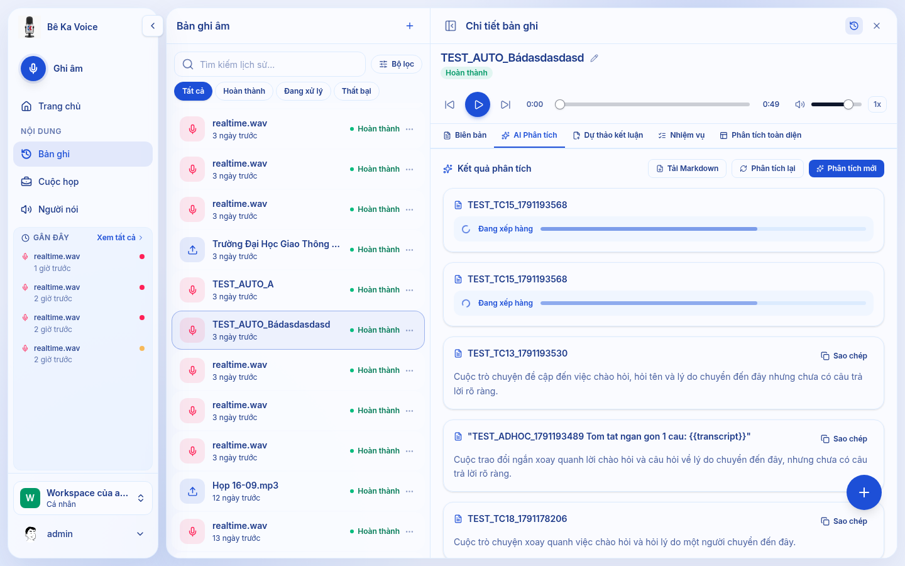
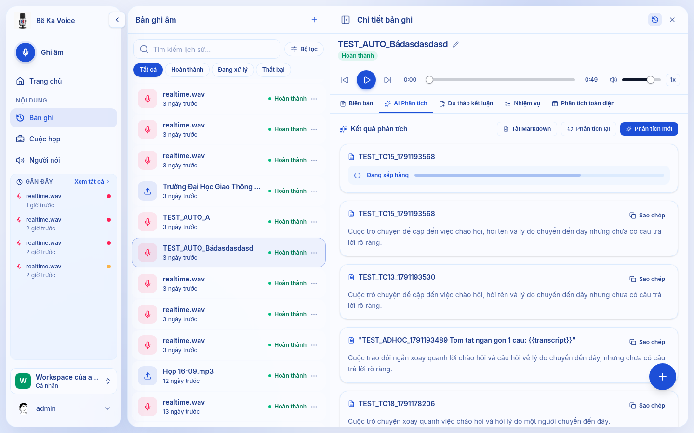

---

## Nhóm 2 – Máy chủ trả lỗi, chức năng không dùng được

**Nguyên nhân chung:** API phía máy chủ lỗi hoặc thiếu; giao diện không xử lý lỗi mà chỉ hiện mã lỗi thô.

### B03 – Đăng ký người nói với nhà cung cấp cochl luôn lỗi 500
- **Mức độ:** Trung bình · **Chức năng:** Người nói · **Test case:** TC19
- **Mong đợi:** Đăng ký người nói với nhà cung cấp nhận diện `cochl` thành công.
- **Thực tế:** API `/speaker/enroll?speaker_provider=cochl` trả `500 Internal Server Error`, giao diện chỉ hiện "request failed (500)", người nói không được tạo. Cùng file âm thanh đó, nhà cung cấp `ecapa` đăng ký thành công.

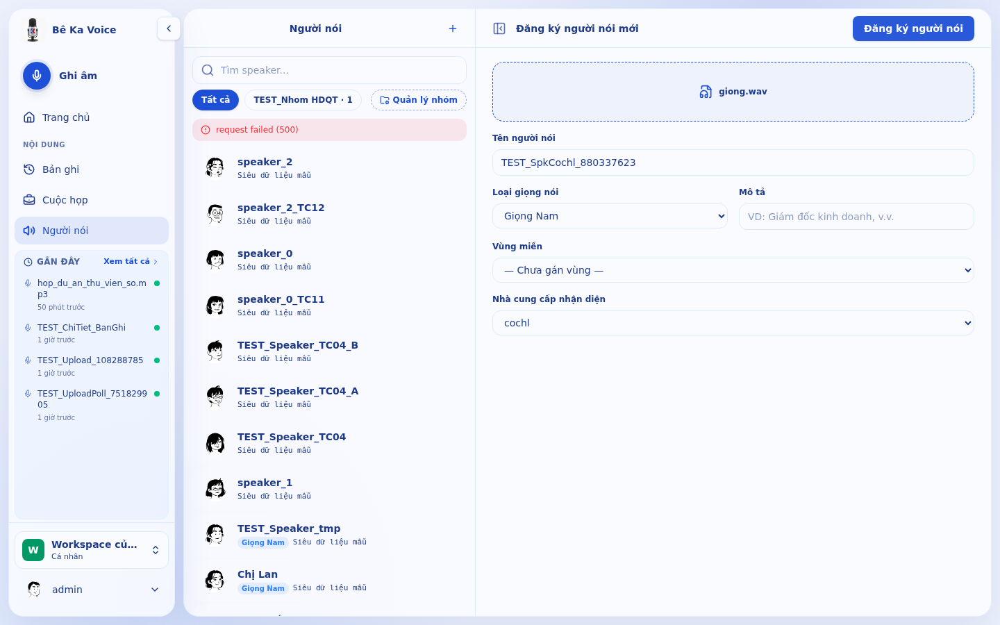

### B04 – Không xóa được prompt, máy chủ trả 405
- **Mức độ:** Trung bình · **Chức năng:** Phân tích AI – Thư viện Prompt · **Test case:** TC06
- **Mong đợi:** Xóa prompt (có hộp xác nhận) thì prompt biến mất khỏi Thư viện Prompt và hộp Công cụ AI.
- **Thực tế:** Bấm Xóa → xác nhận, máy chủ trả `405 Method Not Allowed`, prompt vẫn còn.

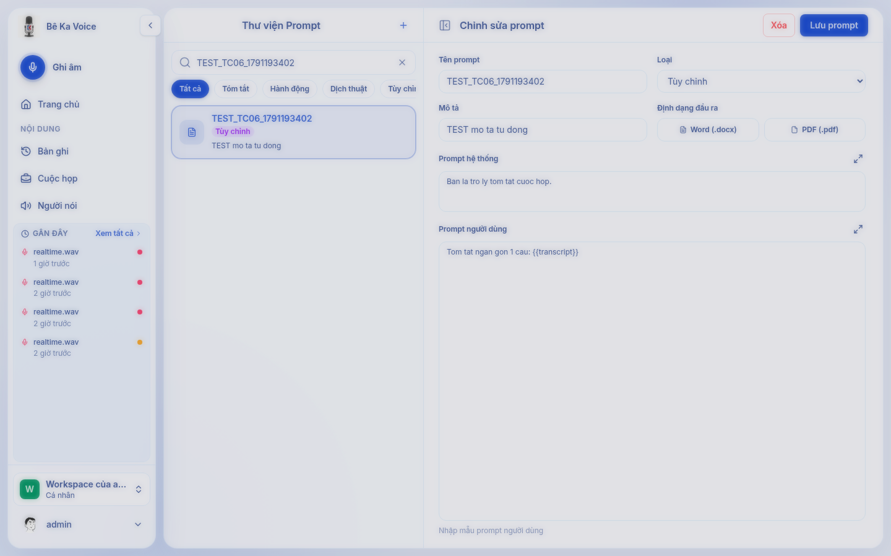
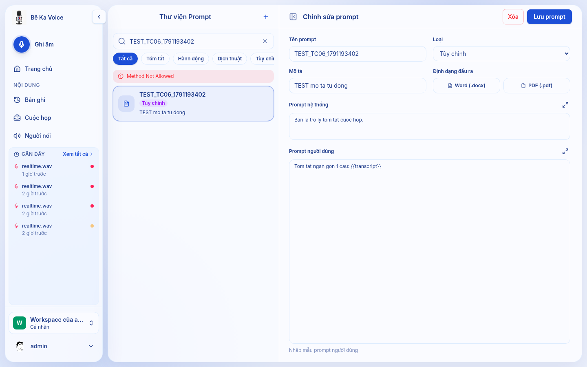

---

## Nhóm 3 – Chức năng dịch trả lại nguyên văn

**Nguyên nhân chung:** API dịch trả `translated_text` giống hệt câu gửi lên, ở cả 3 chiều dịch. Yêu cầu gửi đi đúng tham số (kể cả `source_lang=auto`), nên lỗi nằm ở phía máy chủ dịch. Toàn bộ chức năng dịch hiện không dùng được.

### B05 – Dịch Anh → Việt
- **Mức độ:** Trung bình · **Chức năng:** Dịch văn bản · **Test case:** TC02
- **Mong đợi:** "Good morning, I would like a cup of coffee." được dịch sang tiếng Việt.
- **Thực tế:** Kết quả vẫn là "Good morning, I would like a cup of coffee."

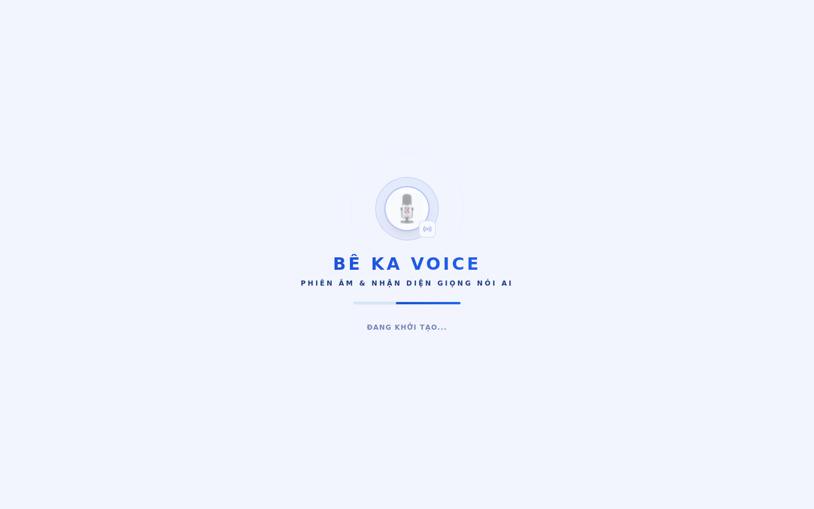

### B06 – Dịch nguồn Tự động → Việt
- **Mức độ:** Trung bình · **Chức năng:** Dịch văn bản · **Test case:** TC03
- **Mong đợi:** App tự nhận ngôn ngữ nguồn là tiếng Anh và dịch sang tiếng Việt.
- **Thực tế:** Kết quả vẫn là câu tiếng Anh gốc.

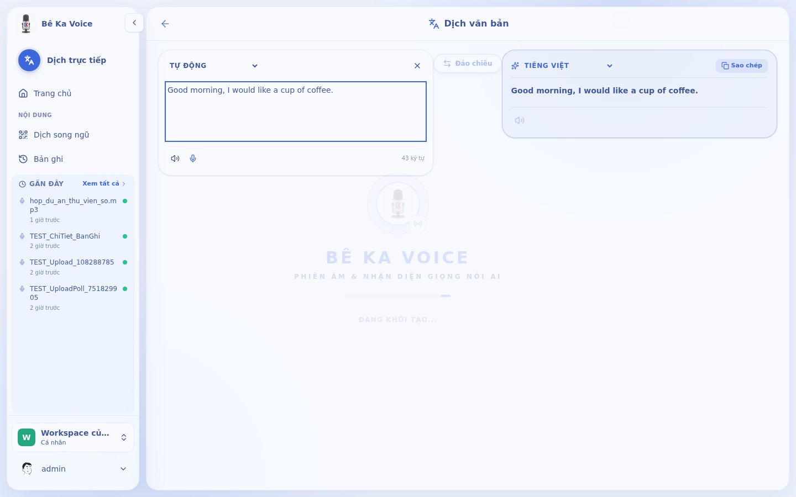

### B07 – Dịch Việt → Anh
- **Mức độ:** Trung bình · **Chức năng:** Dịch văn bản · **Test case:** TC04
- **Mong đợi:** "Xin chào, tôi muốn gọi một ly cà phê." được dịch sang tiếng Anh.
- **Thực tế:** Kết quả vẫn là "Xin chào, tôi muốn gọi một ly cà phê."

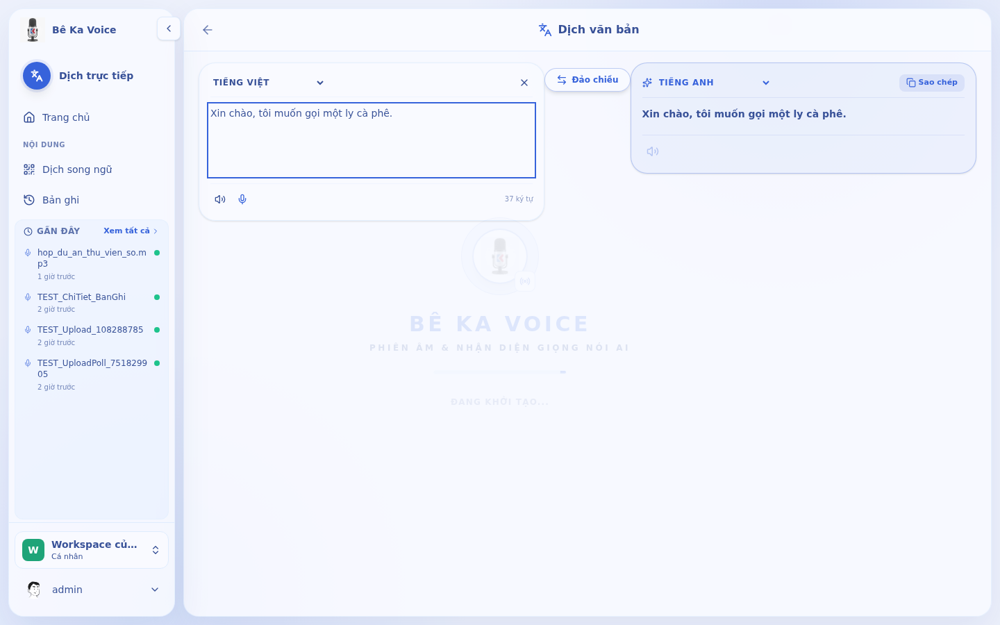

---

## Nhóm 4 – API không trả thời lượng bản ghi

**Nguyên nhân chung:** API danh sách bản ghi trả `duration_sec = null` cho mọi bản ghi. Mọi chỗ dùng thời lượng đều sai theo. Sửa API trả đúng thời lượng sẽ xử lý cả 2 bug.

### B08 – "Thời lượng đã tải" trên trang chủ luôn là 0m
- **Mức độ:** Trung bình · **Chức năng:** Trang chủ · **Test case:** TC15
- **Mong đợi:** Đã có bản ghi hoàn thành thì "Thời lượng đã tải" lớn hơn 0.
- **Thực tế:** Luôn hiện `0m` dù đã có nhiều bản ghi hoàn thành.

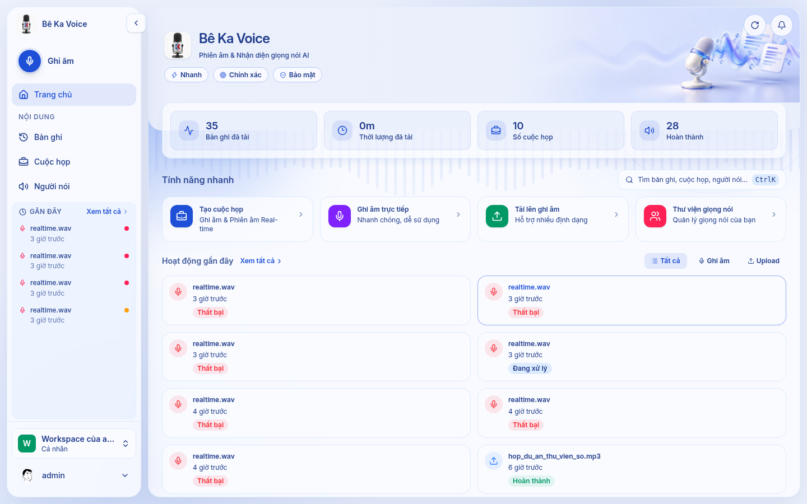

### B09 – Bộ lọc thời lượng luôn trả kết quả rỗng
- **Mức độ:** Trung bình · **Chức năng:** Tìm kiếm & lọc bản ghi · **Test case:** TC07
- **Mong đợi:** Lọc 60–70 phút chỉ hiện bản ghi dài 60–70 phút.
- **Thực tế:** Danh sách luôn rỗng, kể cả khi lọc 0–10000 phút, vì không bản ghi nào có thời lượng.

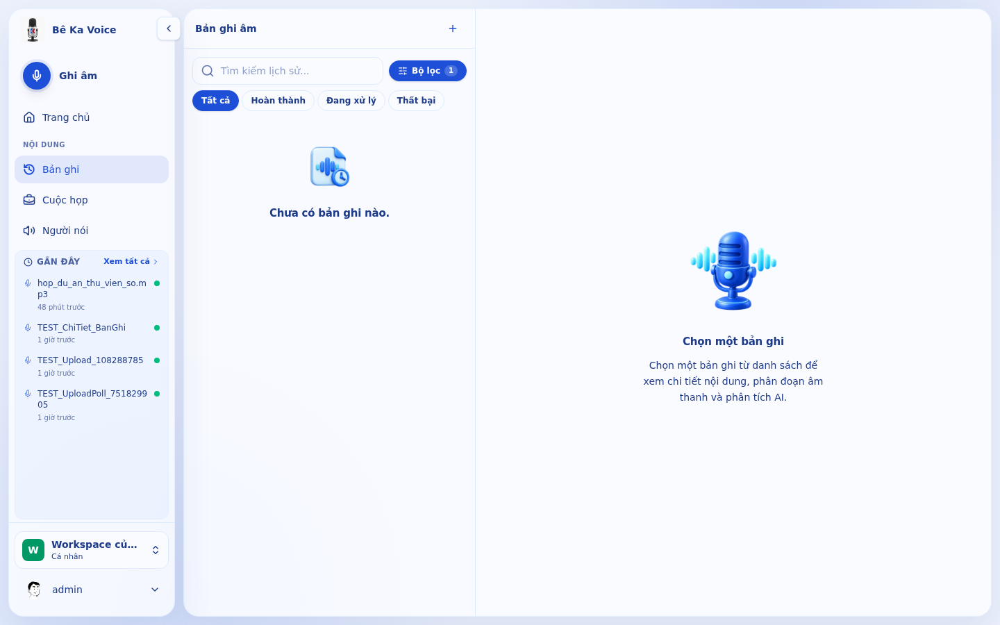

---

## Nhóm 5 – Dữ liệu liên kết bị ghi đè hoặc mất

**Nguyên nhân chung:** máy chủ không kiểm tra quan hệ giữa các đối tượng (người nói, bản ghi, cuộc họp) trước khi ghi hoặc xóa, dẫn tới mất hoặc sai dữ liệu thật của người dùng.

### B10 – Đăng ký trùng tên ghi đè người nói đã có
- **Mức độ:** Trung bình · **Chức năng:** Người nói · **Test case:** TC16
- **Mong đợi:** Đăng ký trùng tên bị chặn hoặc cảnh báo; người nói cũ giữ nguyên.
- **Thực tế:** API trả 200 và gộp vào người nói cũ, đổi Loại giọng (Nữ → Nam) và xóa Mô tả của người nói đã có.

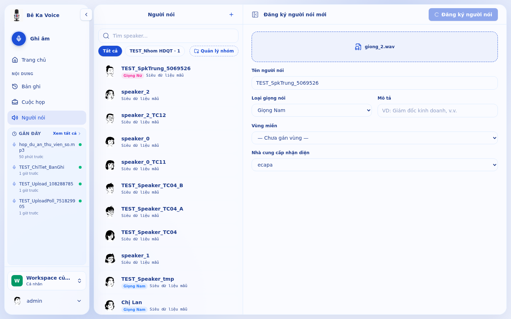

### B11 – Một bản ghi nằm ở nhiều cuộc họp cùng lúc
- **Mức độ:** Trung bình · **Chức năng:** Cuộc họp · **Test case:** TC04
- **Mong đợi:** Mỗi bản ghi chỉ thuộc 1 cuộc họp. Chọn bản ghi đang thuộc cuộc họp khác thì app cảnh báo và chuyển bản ghi sang.
- **Thực tế:** Không cảnh báo, không chuyển bản ghi, tạo luôn cuộc họp mới. Bản ghi thuộc cả 2 cuộc họp.

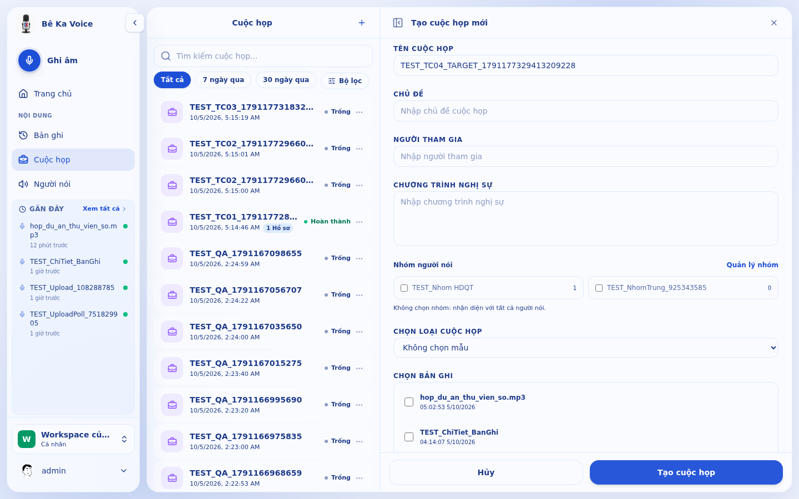

### B12 – Xóa bản ghi duy nhất làm mất luôn cuộc họp
- **Mức độ:** Trung bình · **Chức năng:** Chia sẻ và xóa bản ghi · **Test case:** TC13
- **Mong đợi:** Xóa bản ghi thì cuộc họp vẫn còn, số liệu cập nhật (Tổng bản ghi = 0).
- **Thực tế:** Cuộc họp bị xóa theo; mở lại thì API trả "Meeting không tồn tại".

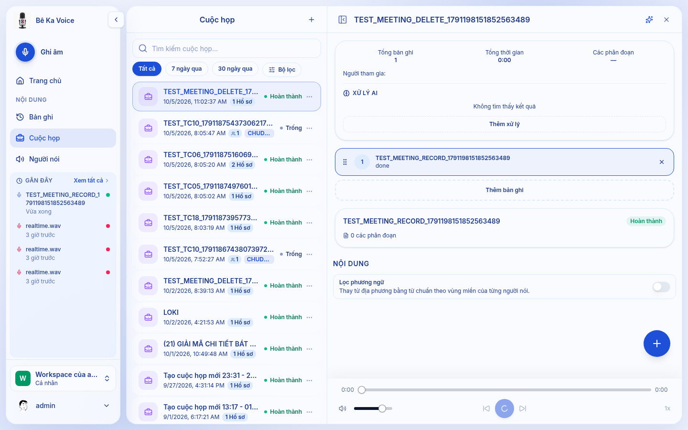
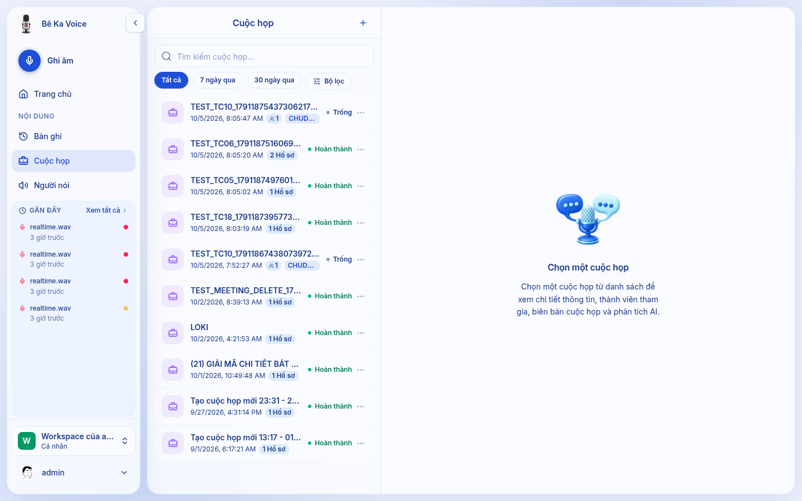

---

## Nhóm 6 – Form không kiểm tra dữ liệu nhập

**Nguyên nhân chung:** form chỉ khai báo ràng buộc ở giao diện (dấu bắt buộc, min/max) hoặc không khai báo, nhưng không kiểm tra lại khi bấm lưu/xác nhận; máy chủ cũng nhận mọi giá trị (trả 200/201).
**Hướng sửa chung:** kiểm tra dữ liệu trước khi gửi, hiện lỗi cạnh ô nhập; máy chủ kiểm tra lại lần nữa.

### B13 – Trường bắt buộc của mẫu cuộc họp không có tác dụng
- **Mức độ:** Thấp · **Chức năng:** Cuộc họp · **Test case:** TC03
- **Mong đợi:** Để trống trường bắt buộc "Ten TCPH" thì app chặn và báo "Vui lòng nhập".
- **Thực tế:** Cuộc họp vẫn được tạo, không báo lỗi.

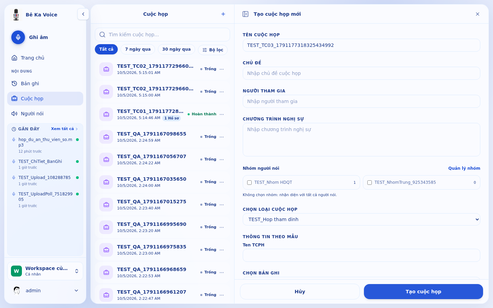

### B14 – Mẫu cuộc họp cho phép hai trường trùng Khóa
- **Mức độ:** Trung bình · **Chức năng:** Mẫu cuộc họp · **Test case:** TC07
- **Mong đợi:** Hai trường có cùng Khóa thì báo lỗi, không tạo mẫu.
- **Thực tế:** Mẫu được lưu bình thường (API trả 201), không có thông báo lỗi.

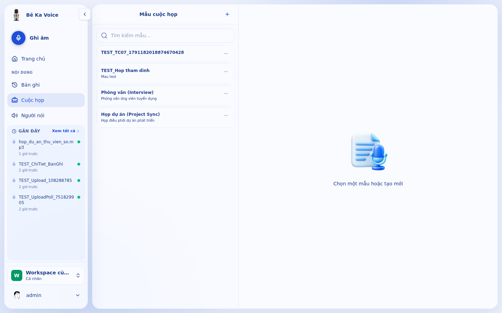

### B15 – Ô "Hạn hoàn thành" nhận giá trị không phải ngày
- **Mức độ:** Thấp · **Chức năng:** Nhiệm vụ sau cuộc họp · **Test case:** TC05
- **Mong đợi:** Nhập `abc` thì báo lỗi hoặc đánh dấu không hợp lệ.
- **Thực tế:** Ô là ô chữ tự do; `abc` được lưu nguyên văn và vẫn còn sau khi tải lại trang. Nên dùng ô chọn ngày.

### B16 – Bấm "Thêm" lưu ngay một nhiệm vụ rỗng
- **Mức độ:** Thấp · **Chức năng:** Nhiệm vụ sau cuộc họp · **Test case:** TC06
- **Mong đợi:** Thêm dòng nhưng bỏ trống mô tả thì không lưu dòng rỗng.
- **Thực tế:** Bấm "Thêm" lưu ngay một nhiệm vụ có mô tả rỗng; sau khi tải lại dòng "Nhấp để nhập mô tả" vẫn còn và bộ đếm tăng 1.

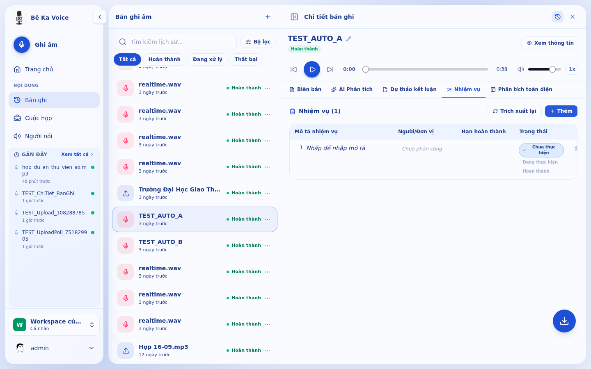
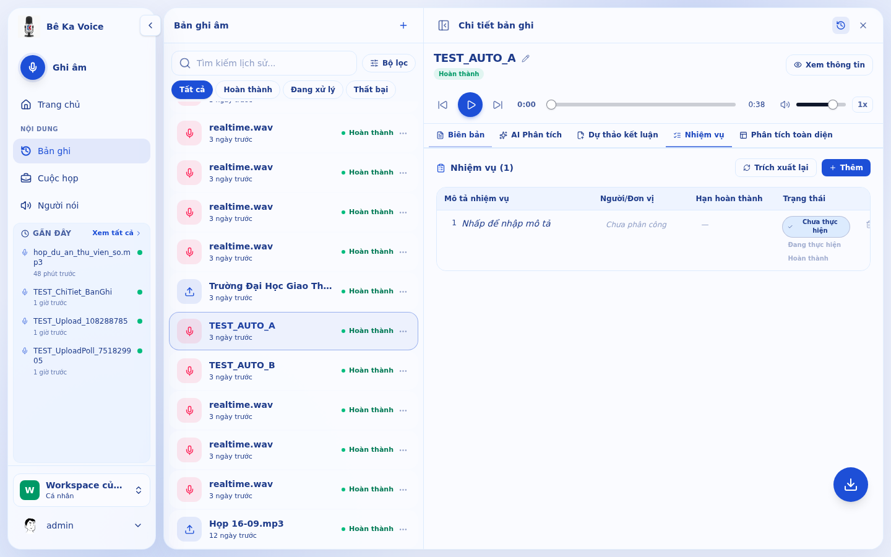

### B17 – Tốc độ bit ngoài khoảng 16–320 vẫn xác nhận được
- **Mức độ:** Trung bình · **Chức năng:** Tải file ghi âm và phiên âm · **Test case:** TC06
- **Mong đợi:** Ô Tốc độ bit (kbps) chỉ cho phép 16–320; nhập ngoài khoảng thì không cho xác nhận.
- **Thực tế:** Nhập `999` rồi bấm Xác nhận, hộp Quy trình vẫn đóng và nhận giá trị.
- **Cần xác nhận:** hành vi mong muốn là chặn lại hay tự đưa về 320.

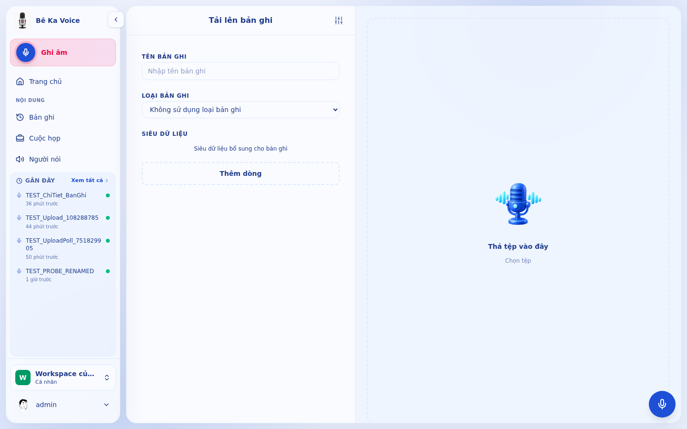

---

## Nhóm 7 – Bộ lọc không kiểm tra khoảng giá trị

**Nguyên nhân chung:** hộp Bộ lọc ở trang Bản ghi áp dụng mọi giá trị mà không kiểm tra. Kết quả chung là nút Bộ lọc hiện "1", danh sách rỗng, người dùng không biết vì sao.
**Hướng sửa chung:** kiểm tra khoảng (từ ≤ đến, không âm) trước khi áp dụng và báo lỗi ngay trong hộp lọc.

### B18 – "Từ ngày" lớn hơn "Đến ngày" vẫn áp dụng được
- **Mức độ:** Trung bình · **Chức năng:** Tìm kiếm & lọc bản ghi · **Test case:** TC10
- **Mong đợi:** Báo lỗi, không áp dụng bộ lọc.
- **Thực tế:** App vẫn gửi `date_from=2026-09-20&date_to=2026-09-01`, danh sách rỗng.

### B19 – Thời lượng Tối thiểu nhận số âm
- **Mức độ:** Trung bình · **Chức năng:** Tìm kiếm & lọc bản ghi · **Test case:** TC22
- **Mong đợi:** Không áp dụng giá trị âm.
- **Thực tế:** Nhập `-5` (ô có min=0) vẫn được áp dụng, danh sách rỗng.

### B20 – Thời lượng Tối thiểu lớn hơn Tối đa vẫn áp dụng được
- **Mức độ:** Trung bình · **Chức năng:** Tìm kiếm & lọc bản ghi · **Test case:** TC23
- **Mong đợi:** Báo lỗi, không áp dụng bộ lọc.
- **Thực tế:** Bộ lọc được áp dụng luôn, danh sách rỗng.

---

## Nhóm 8 – Tìm kiếm không chuẩn hóa từ khóa

**Nguyên nhân chung:** từ khóa được gửi nguyên văn lên máy chủ, không cắt khoảng trắng và không chuẩn hóa Unicode tiếng Việt.
**Hướng sửa chung:** cắt khoảng trắng đầu/cuối và chuẩn hóa Unicode (NFC) cho cả từ khóa lẫn tên bản ghi trước khi so khớp.

### B21 – Từ khóa có khoảng trắng đầu/cuối không tìm thấy kết quả
- **Mức độ:** Trung bình · **Chức năng:** Tìm kiếm & lọc bản ghi · **Test case:** TC20
- **Mong đợi:** Tìm `"  TEST_AUTO_A  "` vẫn ra bản ghi `TEST_AUTO_A`.
- **Thực tế:** App gửi nguyên khoảng trắng lên máy chủ, trả 0 kết quả.

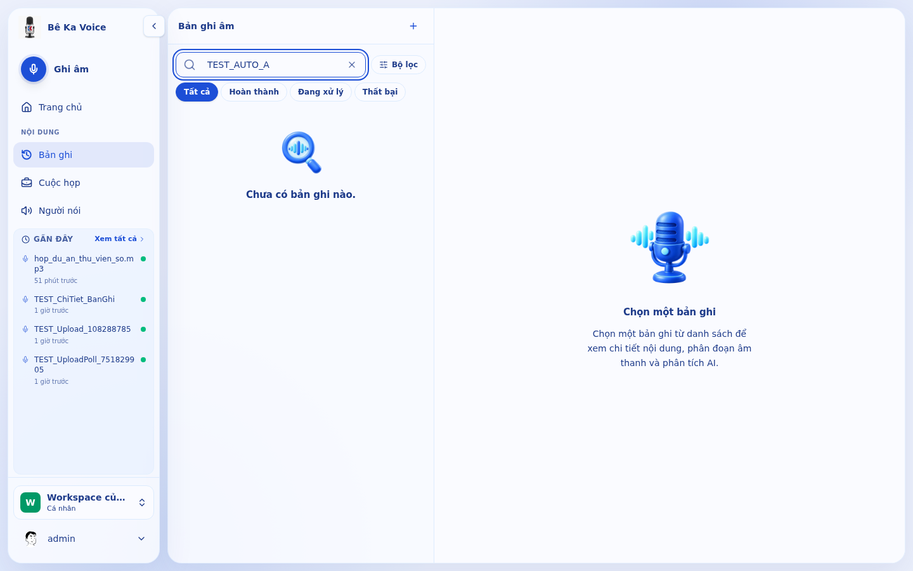

### B22 – Tìm tên tiếng Việt có dấu không ổn định
- **Mức độ:** Trung bình · **Chức năng:** Tìm kiếm & lọc bản ghi · **Test case:** TC13
- **Mong đợi:** Tìm `Họp 16-09.mp3` thì ra bản ghi đó, dù gõ tay hay dán vào.
- **Thực tế:** Kết quả phụ thuộc cách nhập. Test tự động gõ từ bàn phím thì không ra; tester thử tay thấy gõ thì ra nhưng copy–dán thì không. Nguyên nhân: tên file lưu dạng Unicode tổ hợp (NFD), còn từ khóa có thể ở dạng dựng sẵn (NFC), máy chủ không chuẩn hóa nên không khớp.

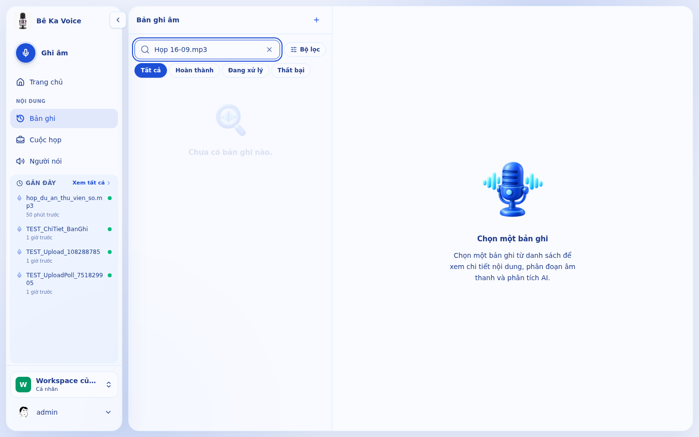

---

## Nhóm 9 – Giao diện không tự cập nhật sau thay đổi

**Nguyên nhân chung:** sau khi dữ liệu thay đổi, danh sách không được tải lại; người dùng phải tải lại trang mới thấy dữ liệu mới.

### B23 – Đổi tên bản ghi xong danh sách bên trái vẫn hiện tên cũ
- **Mức độ:** Trung bình · **Chức năng:** Chi tiết bản ghi · **Test case:** TC09
- **Mong đợi:** Đổi tên xong thì danh sách bên trái hiện tên mới ngay.
- **Thực tế:** Tiêu đề đã đổi thành `TEST_AUTO_B_TC09` nhưng danh sách vẫn hiện `TEST_AUTO_B`. Cùng một bản ghi hiện hai tên trên một màn hình.

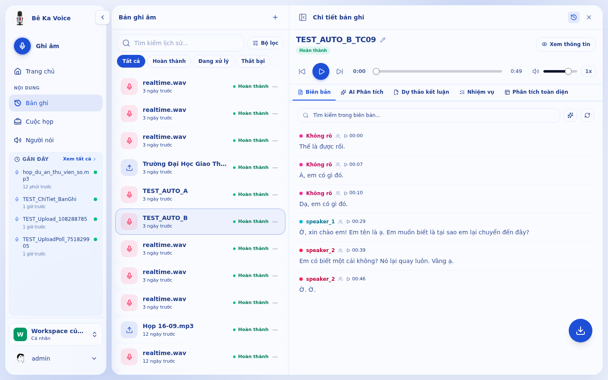

### B24 – Xử lý xong nhưng danh sách vẫn hiện "running"
- **Mức độ:** Trung bình · **Chức năng:** Tải file ghi âm và phiên âm · **Test case:** TC08
- **Mong đợi:** Máy chủ xử lý xong thì dòng bản ghi tự chuyển sang "Hoàn thành".
- **Thực tế:** Theo dõi 30 giây, dòng vẫn đứng ở `running`; phải tải lại trang mới đổi sang "Hoàn thành". Chữ `running` cũng chưa được Việt hóa (xem Nhóm 10).

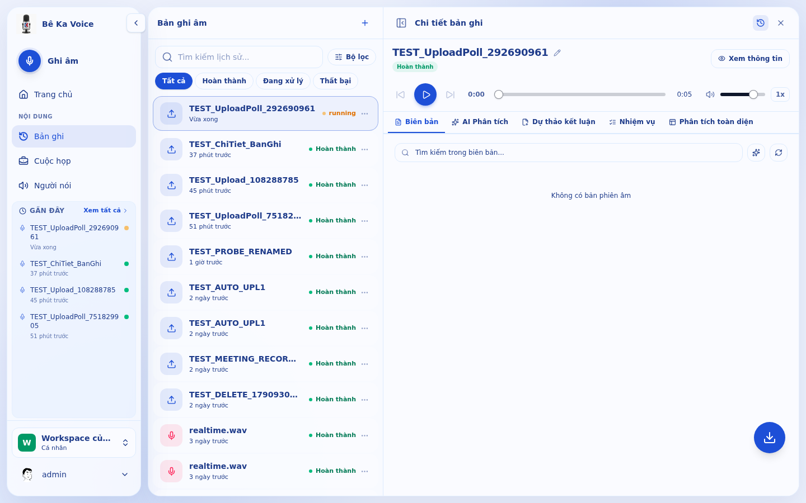

---

## Nhóm 10 – Hiển thị chưa Việt hóa, thông báo lỗi kỹ thuật

**Nguyên nhân chung:** giao diện hiện thẳng mã nội bộ hoặc thông báo lỗi kỹ thuật từ máy chủ thay vì nội dung tiếng Việt dễ hiểu. Lỗi cùng loại còn gặp ở B03 ("request failed (500)") và B24 (`running`).

### B25 – Hộp "Công cụ AI" hiện nhãn loại bằng mã tiếng Anh
- **Mức độ:** Trung bình · **Chức năng:** Phân tích AI · **Test case:** TC09
- **Mong đợi:** Nhãn loại prompt là tiếng Việt, giống Thư viện Prompt.
- **Thực tế:** Hiện mã gốc `summary`, `action_items`, `translation`, `custom`.

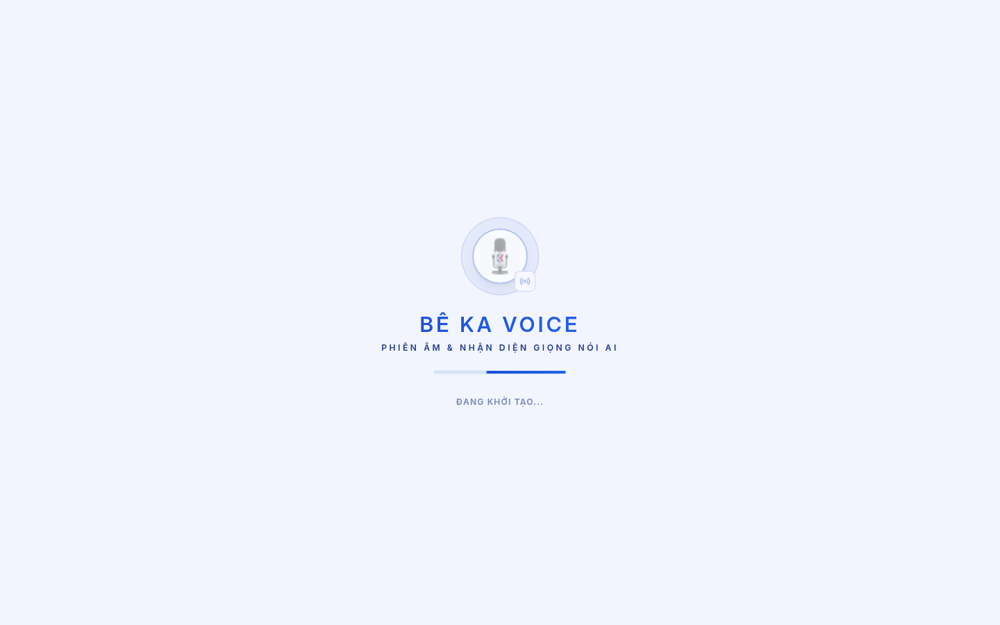
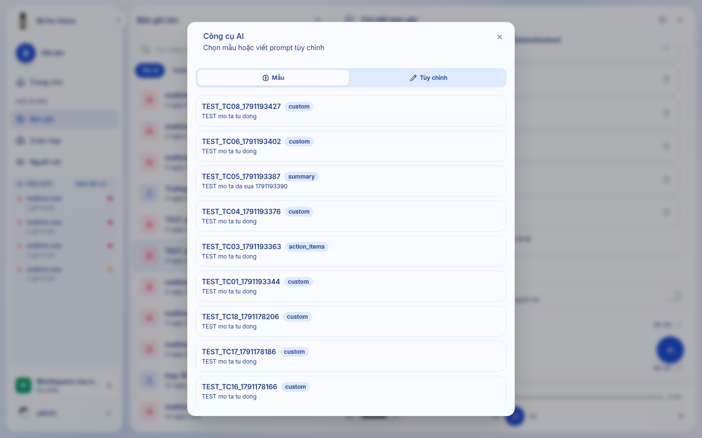

### B26 – Đăng ký trùng tên đăng nhập hiện lỗi kỹ thuật
- **Mức độ:** Trung bình · **Chức năng:** Đăng ký & đăng nhập · **Test case:** TC08
- **Mong đợi:** Báo rõ "Tên đăng nhập đã tồn tại".
- **Thực tế:** Chỉ hiện "Request failed with status code 400".

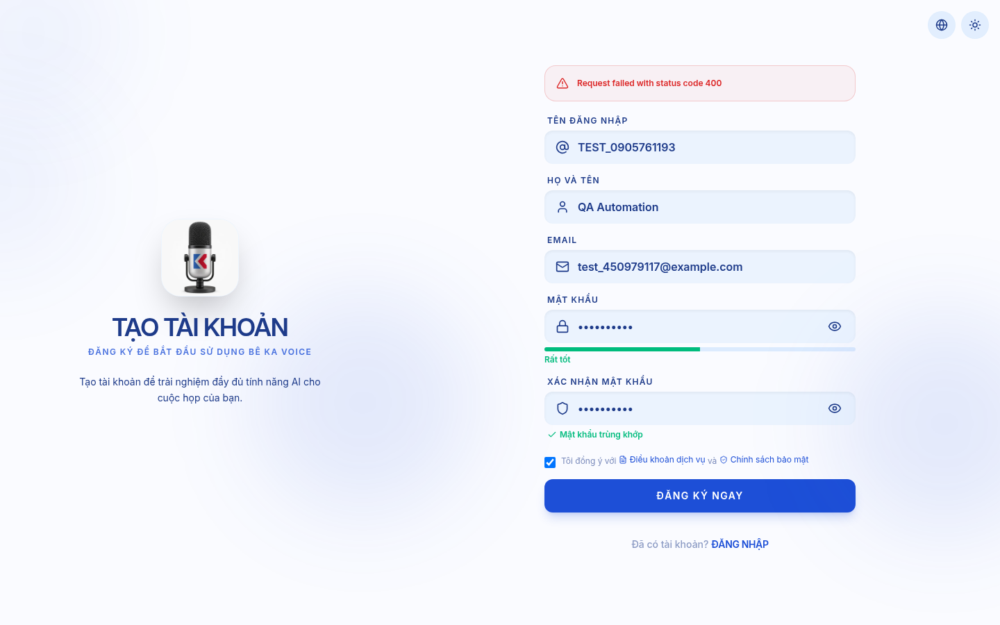

---

## Nhóm 11 – Lỗi riêng lẻ

### B27 – Chọn mẫu cuộc họp không điền sẵn thông tin mặc định
- **Mức độ:** Trung bình · **Chức năng:** Mẫu cuộc họp · **Test case:** TC03
- **Mong đợi:** Chọn mẫu có thông tin mặc định thì form cuộc họp điền sẵn (ví dụ Tên cuộc họp "Họp giao ban tuần").
- **Thực tế:** Tên cuộc họp vẫn là "Tạo cuộc họp mới 06:33 - 05/10/2026"; Chủ đề, Người tham gia, Chương trình nghị sự để trống.

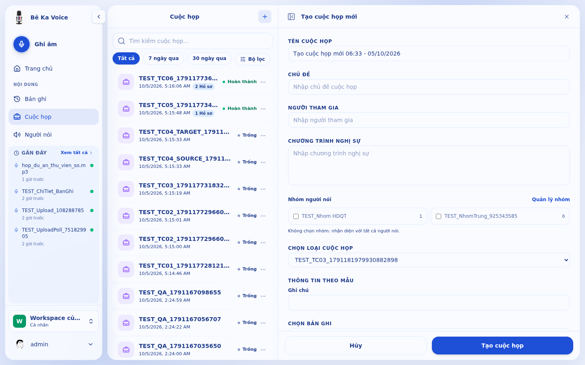

### B28 – Thời gian tạo audio hiển thị lệch 7 giờ
- **Mức độ:** Trung bình · **Chức năng:** Chuyển văn bản thành giọng nói (TTS) · **Test case:** TC07
- **Mong đợi:** Thời gian tạo hiển thị theo giờ Việt Nam.
- **Thực tế:** Tạo lúc 12:53 giờ Việt Nam nhưng hiện 5:53 AM (giờ UTC). API trả `created_at` không kèm múi giờ (ví dụ `2026-10-05T01:44:56`) nên trình duyệt hiểu sai. Nên trả thời gian kèm múi giờ (`Z` hoặc `+07:00`).

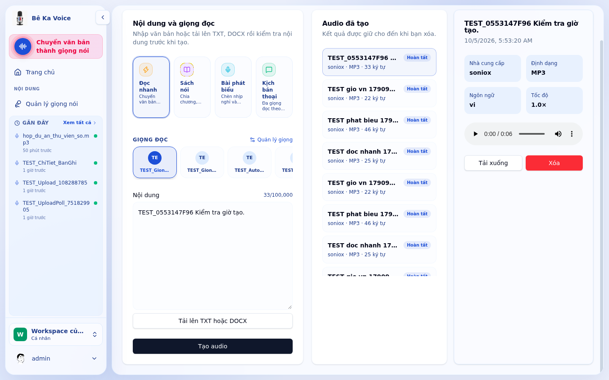

---

## Ghi chú

- **Cần xác nhận hành vi mong muốn:** B17 (chặn hay tự đưa bitrate về 320), B19 (chặn số âm hay tự đưa về 0), B21 (yêu cầu có bắt buộc bỏ khoảng trắng không).
- **Đề xuất nâng mức độ:** B03, B04 (chức năng hỏng hoàn toàn), B05–B07 (cả chức năng dịch không dùng được), B10, B12 (mất dữ liệu người dùng) đang ở mức Trung bình; nên cân nhắc nâng lên Cao.
- Mỗi bug còn có file trace Playwright để xem lại từng bước; trace được lưu trong hệ thống test, không đính kèm ở đây.

